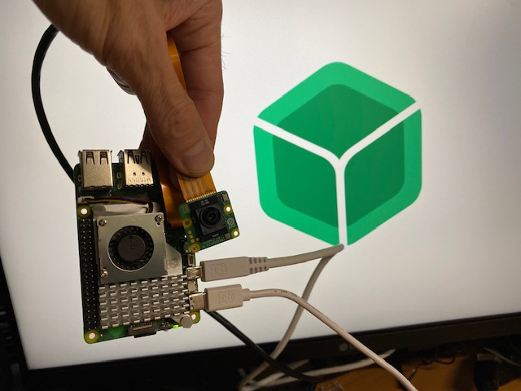

# balena-pi-ai-cam
Example of running the Raspberry Pi AI Camera in a container on balena



## Hardware
This was tested on a Pi 4 and a Pi 5 with camera module 3 and the Pi AI camera module.

**NOTE: As of now, the camera module 3 is detected and the rpicam apps work, however the AI Camera Module is not detected - still a work in progress!**

## Settings

For camera module V2, increase GPU memory to at least 128 GB, and add a DT overlay for "imx219" (in balenaOS you can do these settings via the dashboard in "Device configuration)

## Software

Create a fleet in balenaCloud and push this repo. Flash a Pi 4 or Pi 5 with balenaOS from the fleet.

If you have a Pi AI camera (IMX500) follow these two steps:

- Using the terminal, run ./install.sh which installs the IMX 500 firmware and software (the firmware has access to `/lib/firmware/` via the docker compose label)

- After installing the firmware, reboot the device from the dashboard

For all camera models: 

- After rebooting, go back to the terminal and run the ./start.sh script which should display any detected cameras.

The camera module 2/3 is detected, the Pi AI Camera is not.

Troubleshooting steps taken so far:

- Increased GPU memory to 128MB
- Added "imx500" dtoverlay
- Tried cam0 and cam1 connectors on Pi 5
- Tried a Pi 4

```
root@8e5d9368ae80:/usr/src# libcamera-hello --list-cameras -n -v
No cameras available!
```

## Resources Used

- To build the rpicam apps: https://www.raspberrypi.com/documentation/computers/camera_software.html#building-rpicam-apps-without-building-libcamera
- For bind mounting the firmware folder into the container: https://forums.balena.io/t/how-to-mount-lib-firmware-rw/2949
- Example of adding Pi OS elements to a Debian image: https://github.com/hyzhak/pi-camera-in-docker/blob/main/Dockerfile
