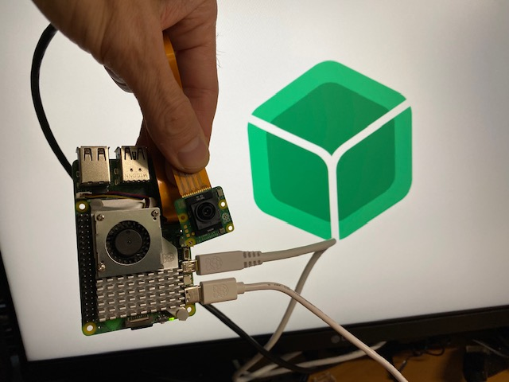

# Pi Cameras
Example of running CSI cameras in a container on [balena](https://www.balena.io/). Use this as a template for enabling camera modules in your own containerized projects.



## Hardware
This was tested on a Pi 4 and a Pi 5 with Raspberry Pi Camera Module 2, 3, and the Pi AI camera module, using balenaOS version 6.12.3+rev3


## Settings

It is recommended to use the camera auto detect by setting `BALENA_HOST_CONFIG_camera_auto_detect` to `1` in the custom configuration section of the Device configuration tab.

Alternatively, add a DT overlay for the camera model in use:
 - V2: "imx219"
 - V3: "imx708"
 - AI: "imx500" (I was only able to auto detect this camera, this DT overlay did not work on balenaOS)

## Software

Create a fleet in balenaCloud, add a new device, and flash a Pi 4 or Pi 5 with the downloaded provisioned balenaOS. Then push this repo to the fleet.

### For all camera models: 

- **After performing any camera-specific instructions below**, run the `./start.sh` script which will start UDEV and display any detected cameras.

For example:

```
Available cameras
-----------------
0 : imx500 [4056x3040 10-bit RGGB] (/base/axi/pcie@1000120000/rp1/i2c@88000/imx500@1a)
    Modes: 'SRGGB10_CSI2P' : 2028x1520 [30.02 fps - (0, 0)/4056x3040 crop]
                             4056x3040 [10.00 fps - (0, 0)/4056x3040 crop]

    Available controls for 4056x3040 SRGGB10_CSI2P mode:
    ----------------------------------------------------
```

Camera-specific instructions:

### Pi AI camera (IMX500)

- Using the terminal, run `./install.sh` which installs the IMX 500 firmware and software. It uses the [extra-firmware feature label](https://docs.balena.io/learn/develop/extra-firmware) to load the firmware.

- After installing the firmware, reboot the device from the dashboard

- After running `./start.sh`, you can see an example of image classification on the imx500 by running `/.imx500_test.sh`

- The example installs [Picamera2](https://github.com/raspberrypi/picamera2) and some Python libraries, then runs a demo modified for headless use


## Troubleshooting

If your Pi AI camera is not detected, check that it has at least firmware version 15. The process to check the camera's firmware and update it is outlined here: https://forums.raspberrypi.com/viewtopic.php?t=378050#p2260801

You may also need to increase GPU memory to 64 or 128 MB.

## Resources Used

- To build the rpicam apps: https://www.raspberrypi.com/documentation/computers/camera_software.html#building-rpicam-apps-without-building-libcamera
- For adding the AI camera firmware: https://blog.balena.io/enabling-hardware-peripherals-on-balenaos-devices/
- Example of adding Pi OS elements to a Debian image: https://github.com/hyzhak/pi-camera-in-docker/blob/main/Dockerfile
